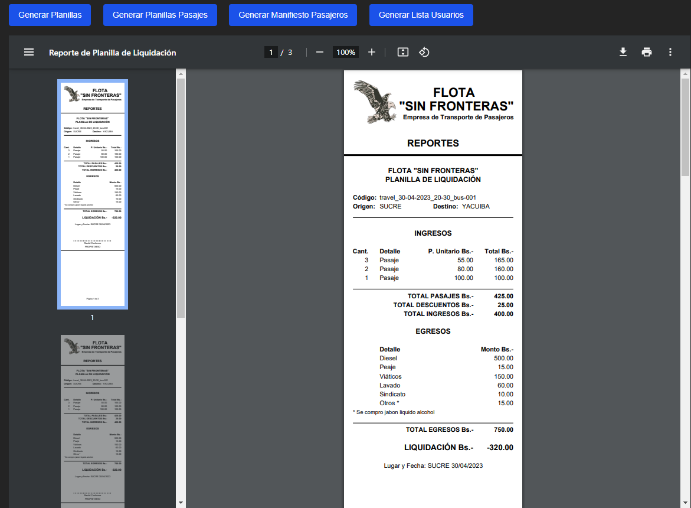

# Reportes en JSPdf

## Ejecutar el proyecto

Descargar el proyecto desde el repositorio de gitHub:

```bash
git clone https://github.com/fermelli/reportes-jspdf.git
```

### Dependencias

-   [jsPDF](https://github.com/parallax/jsPDF) - Generación de PDF JavaScript del lado del cliente.
-   [jsPDF-AutoTable](https://github.com/simonbengtsson/jsPDF-AutoTable) - Complemento de `jsPDF` para generar tablas PDF con JavaScript.

Instalar las dependencias:

```bash
npm install
```

o

```bash
yarn install
```

Para correr el proyecto se debe ejecutar el siguiente comando:

```bash
npm run dev
```

o

```bash
yarn dev
```

Luego abrir el navegador en la siguiente dirección: [http://localhost:5173](http://localhost:5173)

## Captura de pantalla


